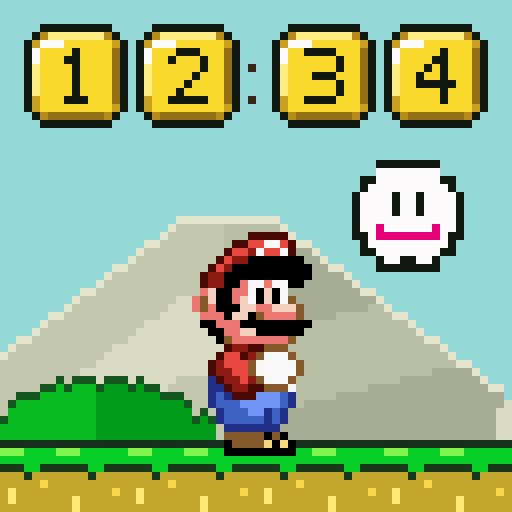
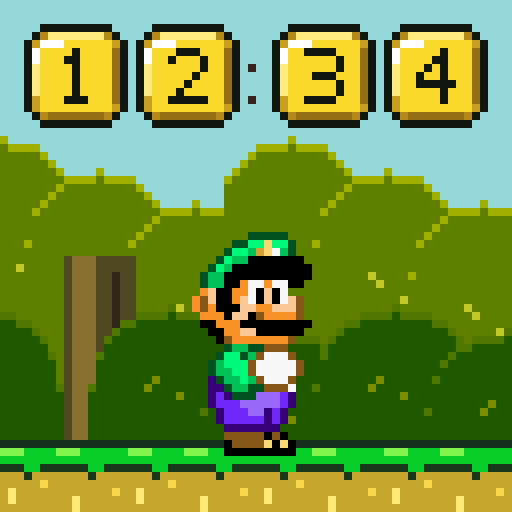
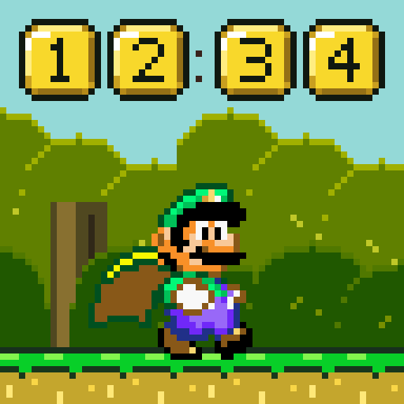
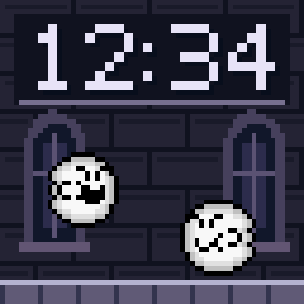
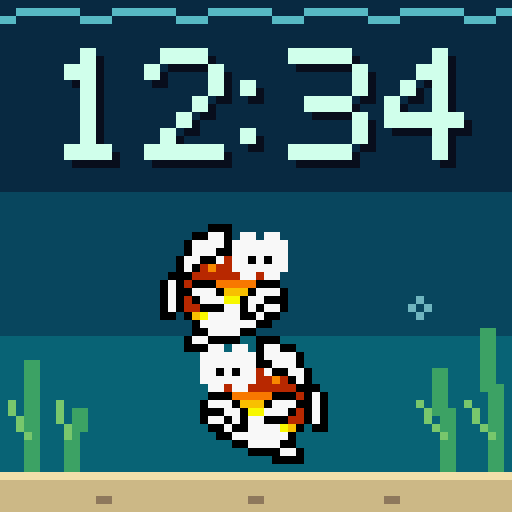
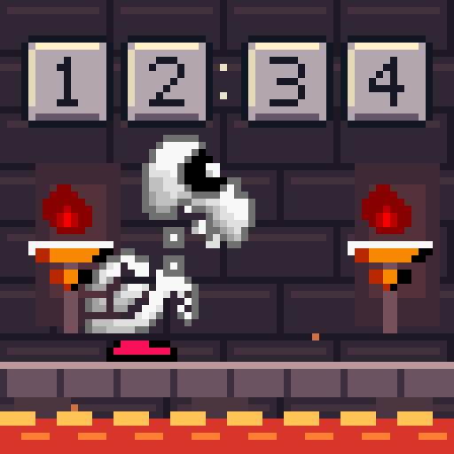
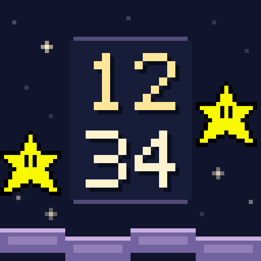
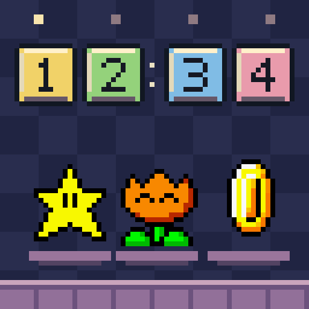

# SNES clock packs

## Native clock packs 1, 2 and 3

[Download and browse the three native packs](collections/native-clock-packs-1.0.0/README.md)
— **41 faces**, split into **15 / 11 / 15**. All three compiled selections fit
the current 1.75 MiB OTA slot, one pack at a time. Includes animated previews,
native assets, firmware build source, checksums and measured size reports.
Both discarded Chrono Trigger faces and the Zelda zoom tour are excluded.

These use **SNTL and require a firmware rebuild**. They cannot be installed using
the older SNPK download selector described below. No ready-to-flash image or
private device credentials are included.

## Original downloadable SNPK packs

Five downloadable SNPK v1 scene packs for the SNES clock's `packs-1.0.0` firmware.
This repository is the pack library; it does not contain a flashable firmware image.
The clock downloads one selected pack, checks its SHA-256, and renders it locally.
Mario, Luigi Forest and Cape Luigi Forest remain built-in fallback scenes.

| Scene | File bytes | Engine |
|---|---:|---:|
| Ghost House | 1,192 | 1 |
| Tide Pool | 344 | 2 |
| Lava Fortress | 2,840 | 3 |
| Star Road | 324 | 4 |
| Bonus Room | 1,484 | 5 |

Total: 6,184 bytes. Full hashes and filenames are in [the catalog](packs/manifest.json).
Packs contain indexed sprite artwork, not executable code. New scene behaviors
require compatible firmware. The device currently supports at most 16 KiB per
pack and keeps only the selected pack in RAM; rebooting returns to a built-in
scene until a controller reapplies the selection.

## Animated clock faces

All eight faces, rendered at 25 fps. Each 12-second loop includes a minute change.

| | |
|---|---|
| **Mario**<br><br>[Native 64×64 GIF](previews/mario-64.gif) | **Luigi Forest**<br><br>[Native 64×64 GIF](previews/luigi-64.gif) |
| **Cape Luigi Forest**<br><br>[Native 64×64 GIF](previews/cape-luigi-64.gif) | **Ghost House**<br><br>[Native 64×64 GIF](previews/ghost-house-64.gif) |
| **Tide Pool**<br><br>[Native 64×64 GIF](previews/tide-pool-64.gif) | **Lava Fortress**<br><br>[Native 64×64 GIF](previews/lava-fortress-64.gif) |
| **Star Road**<br><br>[Native 64×64 GIF](previews/star-road-64.gif) | **Bonus Room**<br><br>[Native 64×64 GIF](previews/bonus-room-64.gif) |

[Download all eight GIFs in native and enlarged sizes](previews/all-eight-clock-faces.zip).

Crisp nearest-neighbour enlargement; legacy background smoothing is disabled. These GIFs are previews, not installable packs. See [artwork provenance](ARTWORK.md).

## Final Fantasy VI animation collection

[Download the 19-face animation package](collections/ffvi-1.0.0/ffvi-clock-animations-1.0.0.zip) · [Browse all FFVI previews](collections/ffvi-1.0.0/README.md)

Native 64×64 and enlarged 512×512 GIFs, PNG stills, an offline HTML gallery, and a SHA-256 manifest. Includes 14 Keep faces and the latest revisions of five faces still marked Change; discarded faces are excluded.

These are preview assets with a fixed 12:34 display, **not installable SNPK packs**. See the [FFVI artwork credits](collections/ffvi-1.0.0/ARTWORK.md).

## Load from GitHub

Use an immutable, full 40-character commit SHA as the library base:

```text
https://raw.githubusercontent.com/zeekens/snes-mari-oclock/03400729f378f8e02f927c812e9439bff8cc1c9a/packs
```

Append a filename from the catalog and supply its complete SHA-256 to the device:

```yaml
action: esphome.snes_clock_load_scene_pack
data:
  pack_url: https://raw.githubusercontent.com/zeekens/snes-mari-oclock/03400729f378f8e02f927c812e9439bff8cc1c9a/packs/ghost-house-5153597b60d369d7.scn
  expected_hash: 5153597b60d369d7eeeecfd9cef06b46e9d6750c8428a07f4eda017eb4762f5b
```

The URL above is the device-tested immutable version. Branch URLs, HTML `blob`
pages, redirects, authentication tokens, and private-repository downloads are
unsupported. HTTPS certificates and the expected file hash are verified.
Request acceptance is asynchronous: check Pack Status becomes `ready` and
Active Scene becomes the requested scene ID. A failed replacement preserves the
previous scene.

## Home Assistant controls

With `packs-1.1.0` firmware, use the existing ESPHome **Scene** selector: it offers
all eight scenes and automatically downloads the five remote packs from the
pinned GitHub library above. No extra HA package is required for that flow.
Remote choices persist and are requested again after boot/Wi-Fi reconnection,
once network and clock time are ready for TLS.

The optional package below provides a separate source selector for HA hosting
or a custom GitHub library. Use one controller consistently: its desired face
and the native Scene selector do not synchronize with each other.

1. Copy [the HA package](home-assistant/snes_clock_packs.yaml) into your HA
   `packages/` directory. If needed, enable packages under the existing
   `homeassistant:` configuration with `packages: !include_dir_named packages`.
   Merge into existing settings; do not create duplicate keys.
2. Adjust ESPHome action and entity IDs to match your clock. Examples use
   `snes_clock`; renamed devices may have a different prefix for newly discovered
   diagnostics and the status binary sensor.
3. Validate HA configuration and restart to load the package.
4. Add [the dashboard card](home-assistant/dashboard-card.yaml).
5. Choose GitHub as source, then select a face. The script defaults to the
   tested commit above when the GitHub Library URL helper is empty. Set a
   different commit-pinned URL to override it. Apply face retries the choice.

Alternatively copy `packs/` contents into `/config/www/snes-clock/`, set the HA
Library URL to `http://homeassistant.local:8123/local/snes-clock` (adjust hostname
and port), and choose Home Assistant as source. HA's `/local/` files are served
without authentication; place only pack data there. Creating `www/` for the first
time requires a restart.

The helper records the desired face; Active Scene records the actual face. The
supplied automation reapplies selection on HA startup or when the clock becomes
available. Use this helper consistently; direct changes to the device's built-in
Scene select do not synchronize the helper. No persistent asset cache or timed
retry loop is implemented.

## Validation and artwork

All five packs passed local/native parser and pixel-equivalence tests and actual
ESP32 LAN HTTP tests, including invalid-download retention, cancellation, and
supersession. All five files also downloaded directly from GitHub and activated
on the ESP32; see [device validation](VALIDATION.md). HA package installation and physical display verification are
installation-specific acceptance checks.

The artwork is game-derived. See [ARTWORK.md](ARTWORK.md) for provenance and
rights limitations; this repository does not grant rights to Nintendo artwork.
