# Final Fantasy VI clock animations · 1.0.0

19 animated clock faces, each a 12-second loop on a 25 FPS timeline. Native 64×64 GIFs and PNG stills include exact 8× (512×512) enlargements. Repeated identical GIF frames may use longer delays.

These are **preview animation assets**, not SNPK files or flashable firmware. The digits are baked in as 12:34. They cannot be loaded through the existing SNPK scene-pack selector.

Open `index.html` locally to browse the collection. File sizes and SHA-256 hashes are in [manifest.json](manifest.json). See [artwork credits](ARTWORK.md).

The package includes 14 Keep faces and the latest versions of five faces still marked Change (02, 06, 13, 15, 18). Discarded faces are excluded.

| Face | Animation |
|---|---|
| 01 · Narshe / Snowfall | 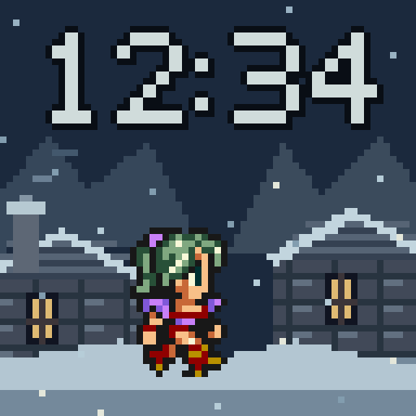 [Native GIF](01-narshe-64.gif) |
| 02 · Figaro / Desert Citadel | 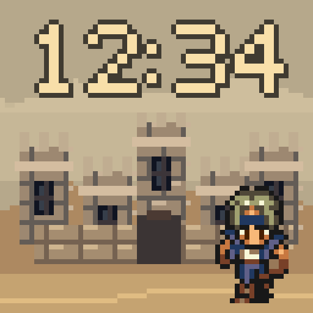 [Native GIF](02-figaro-64.gif) |
| 03 · Zozo / Rain & Rooftops | 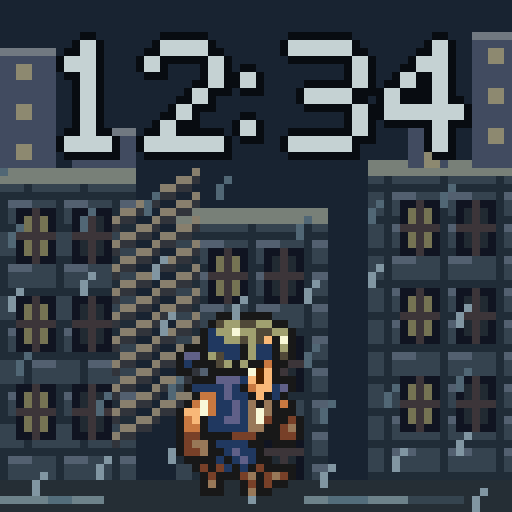 [Native GIF](03-zozo-64.gif) |
| 05 · Phantom Train / Last Departure | 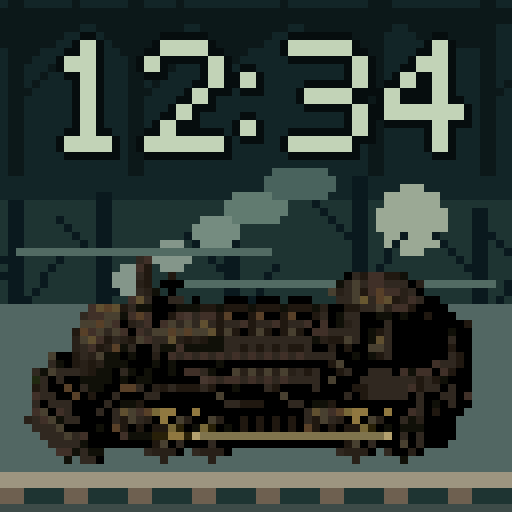 [Native GIF](05-phantom-train-64.gif) |
| 06 · Blackjack / Above the Clouds | 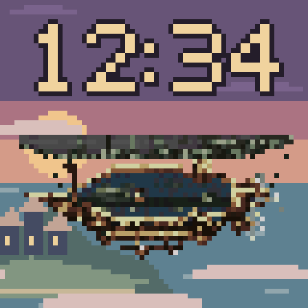 [Native GIF](06-blackjack-64.gif) |
| 07 · Floating Continent / Edge of Ruin | 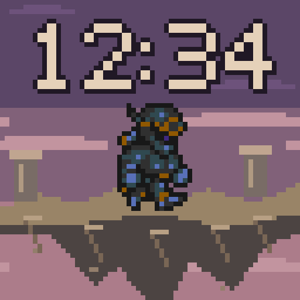 [Native GIF](07-floating-continent-64.gif) |
| 08 · Magitek / Esper Chamber | 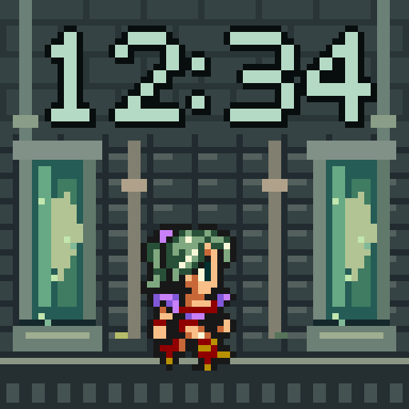 [Native GIF](08-magitek-64.gif) |
| 09 · Lete River / Hold On! | 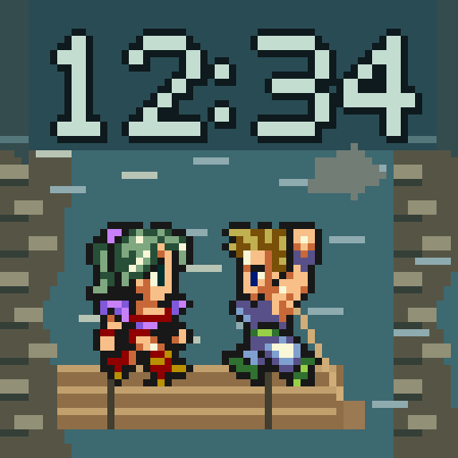 [Native GIF](09-lete-rapids-64.gif) |
| 10 · Narshe Cavern / Dance for Treasure | 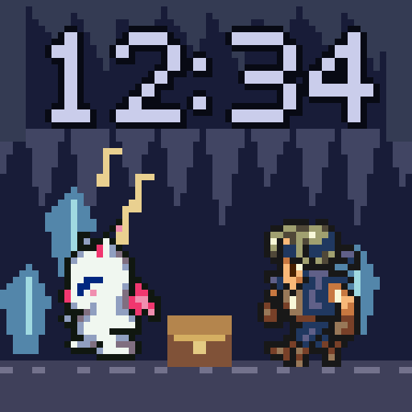 [Native GIF](10-moogle-treasure-64.gif) |
| 11 · Opera House / A Rose for You | 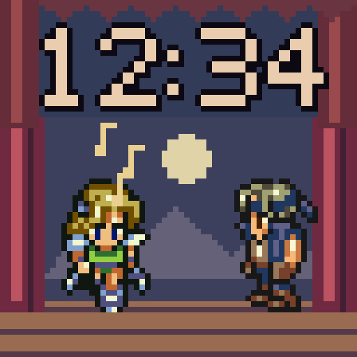 [Native GIF](11-opera-rose-64.gif) |
| 12 · Phantom Forest / Interceptor! | 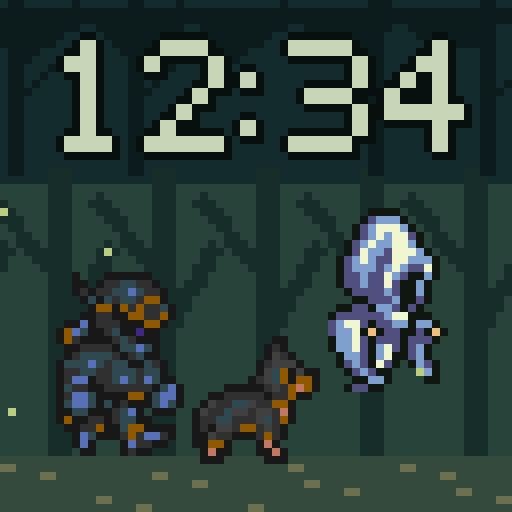 [Native GIF](12-forest-chase-64.gif) |
| 13 · Sealed Gate / Esper Awakening | 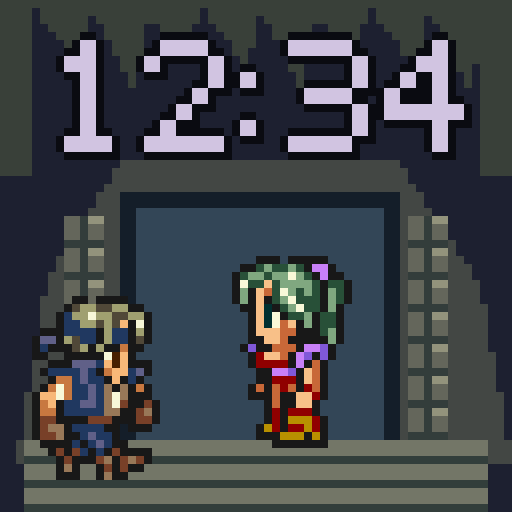 [Native GIF](13-esper-awakening-64.gif) |
| 14 · South Figaro / Rooftop Escape | 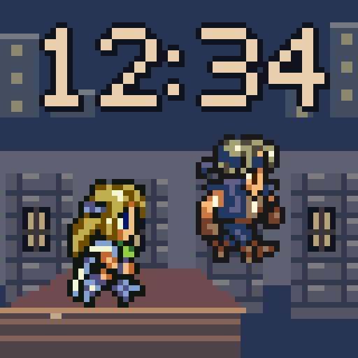 [Native GIF](14-rooftop-escape-64.gif) |
| 15 · Ultros / Fire Dance | 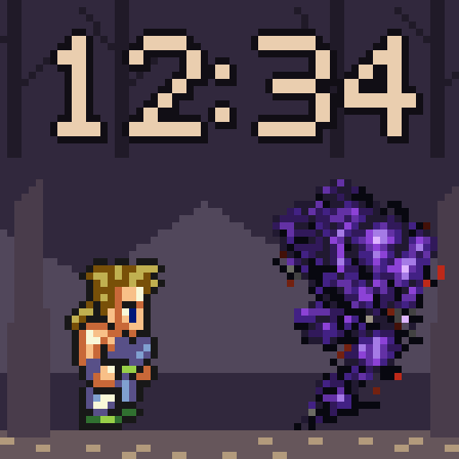 [Native GIF](15-fire-dance-64.gif) |
| 16 · Figaro Desert / Chocobo Dash | 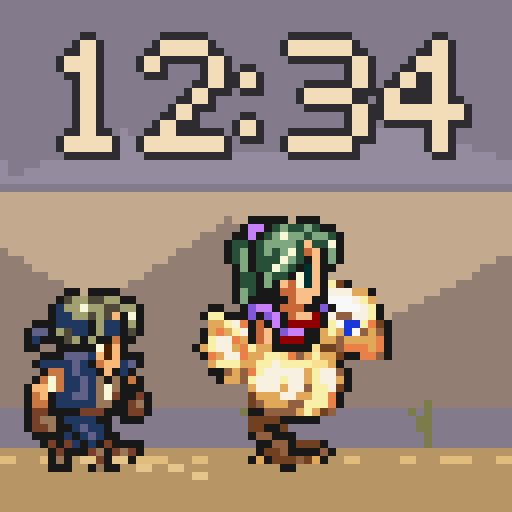 [Native GIF](16-chocobo-dash-64.gif) |
| 17 · Ultros / Fire on the River | 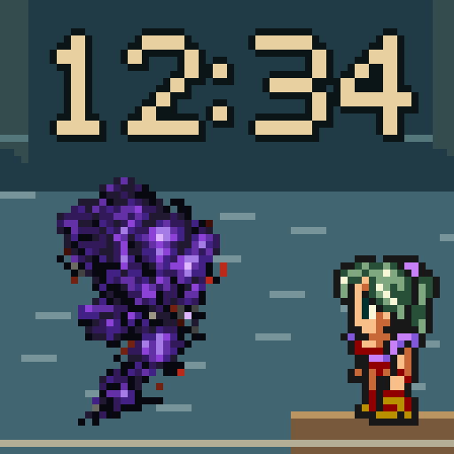 [Native GIF](17-ultros-64.gif) |
| 18 · Whelk / Shell Shock | 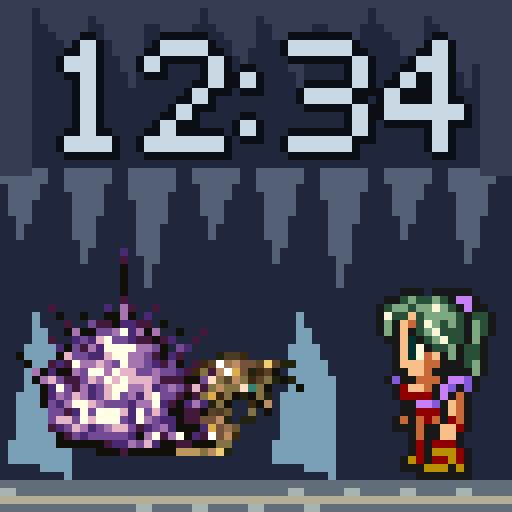 [Native GIF](18-whelk-64.gif) |
| 19 · Magitek Armor / Runic & Ice | 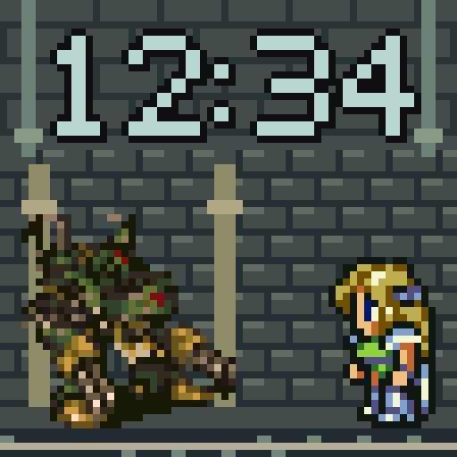 [Native GIF](19-magitek-armor-64.gif) |
| 22 · Forest Swarm / Dance & Cure | 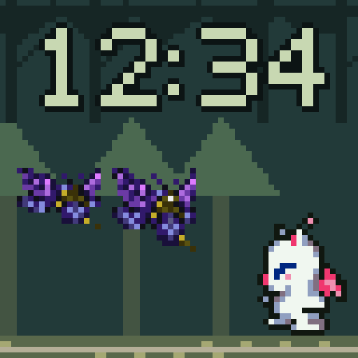 [Native GIF](22-forest-swarm-64.gif) |
