# Native clock pack 1 · 1.0.0

15 animated faces at 64×64, 25 FPS, 12-second loops. Native SNTL assets
use live clock digits; the GIF previews show fixed 12:34.

## Download and compatibility

[Download Pack 1](../snes-clock-pack-1-1.0.0.zip). Open `index.html` for an offline gallery.

This is a **native asset and firmware source package**, not a ready-to-flash
image. It requires the included SNTL player and a firmware rebuild. The older
SNPK download selector cannot load it. Install one pack at a time.

## Verified size

- Native assets: 757,427 bytes.
- Compiled OTA image with build-only credentials: **1,757,616 bytes**.
- OTA application partition: 1,835,008 bytes.
- Space remaining: **77,392 bytes (75.6 KiB)**.
- Static RAM: 71,520 bytes.

The complete selection compiled successfully using ESPHome 2026.8.2 for the
existing 4 MB ESP32 configuration. ZIP size is not on-device flash size.
Credentials, toolchain updates or firmware changes can change the final size;
recheck before installing. These native packs have not been tested on the
physical panel. [Compile evidence](compile-size.json) · [Pixel validation](validation.json).

## Build

Use Python 3 and ESPHome 2026.8.2. From this unpacked directory:

```sh
python3 tools/build_firmware.py
esphome compile build/sizecheck.yaml
```

The supplied `firmware/snes-clock.yaml` contains deliberately fake credentials
for compile checks. Set your own Wi-Fi, encrypted API and OTA credentials in a
private copy before any deployment, and confirm that the panel wiring matches
your hardware. Never commit those credentials. The script only generates build
files; neither command uploads firmware. Firmware sources and native assets
are included so the selection can be rebuilt without the private gallery.

## Faces

| Face | Native bytes | Preview |
|---|---:|---|
| The Legend of Zelda: A Link to the Past — Light World / Link’s House Overworld | 17,942 | 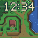 |
| Super Metroid — Escape Shaft / Samus under Fire | 36,482 | 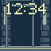 |
| Super Mario World 2: Yoshi’s Island — Egg Garden / Yoshi Meets the Parade | 45,363 | 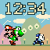 |
| Mega Man X — Central Highway / Zero’s Charge | 31,612 | 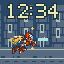 |
| Mega Man X — Sting Chameleon Forest / X’s Buster | 67,790 | 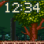 |
| Super Castlevania IV — Castle Approach / Simon’s Whip | 27,905 | 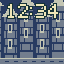 |
| Street Fighter II Turbo: Hyper Fighting — Brazil / Ryu versus Blanka | 47,532 | 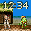 |
| Super Mario Kart — Mario Circuit / Mario’s Solo Lap | 51,063 | 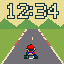 |
| Super Mario Kart — Mario Circuit 1 / Whole-Course Minimap | 46,356 | 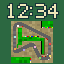 |
| Final Fantasy VI — Narshe / Snowfall | 74,933 | 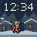 |
| Final Fantasy VI — Phantom Train / Last Departure | 62,609 | 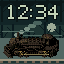 |
| Final Fantasy VI — Lete River / Hold On! | 83,319 | 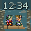 |
| Final Fantasy VI — Opera House / A Rose for You | 16,717 | 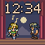 |
| Final Fantasy VI — Sealed Gate / Esper Awakening | 129,689 | 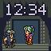 |
| Final Fantasy VI — Whelk / Shell Shock | 18,115 | 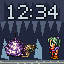 |

[Manifest and asset hashes](manifest.json) · [Format](FORMAT.md) · [Artwork provenance](ARTWORK.md).
