# Native clock pack 2 · 1.0.0

11 animated faces at 64×64, 25 FPS, 12-second loops. Native SNTL assets
use live clock digits; the GIF previews show fixed 12:34.

## Download and compatibility

[Download Pack 2](../snes-clock-pack-2-1.0.0.zip). Open `index.html` for an offline gallery.

This is a **native asset and firmware source package**, not a ready-to-flash
image. It requires the included SNTL player and a firmware rebuild. The older
SNPK download selector cannot load it. Install one pack at a time.

## Verified size

- Native assets: 822,296 bytes.
- Compiled OTA image with build-only credentials: **1,822,160 bytes**.
- OTA application partition: 1,835,008 bytes.
- Space remaining: **12,848 bytes (12.5 KiB)**.
- Static RAM: 71,520 bytes.

The complete selection compiled successfully using ESPHome 2026.8.2 for the
existing 4 MB ESP32 configuration. ZIP size is not on-device flash size.
Credentials, toolchain updates or firmware changes can change the final size;
recheck before installing. These native packs have not been tested on the
physical panel. [Compile evidence](compile-size.json) · [Pixel validation](validation.json).

## Build

Use Python 3 and ESPHome 2026.8.2. From this unpacked directory:

```sh
python3 tools/build_firmware.py
esphome compile build/sizecheck.yaml
```

The supplied `firmware/snes-clock.yaml` contains deliberately fake credentials
for compile checks. Set your own Wi-Fi, encrypted API and OTA credentials in a
private copy before any deployment, and confirm that the panel wiring matches
your hardware. Never commit those credentials. The script only generates build
files; neither command uploads firmware. Firmware sources and native assets
are included so the selection can be rebuilt without the private gallery.

## Faces

| Face | Native bytes | Preview |
|---|---:|---|
| Super Metroid — Maridia / Drifting Colony | 102,700 | 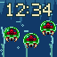 |
| Super Mario All-Stars — Water Land / Luigi’s Ferry | 34,276 | 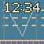 |
| Donkey Kong Country 2: Diddy’s Kong Quest — Rambi Rumble / Rhino Charge | 86,188 | 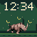 |
| Donkey Kong Country 2: Diddy’s Kong Quest — Squawks’s Shaft / Lantern Flight | 83,104 | 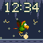 |
| Street Fighter II Turbo: Hyper Fighting — Suzaku Castle / Ryu versus Chun-Li | 15,099 | 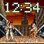 |
| Super Mario Kart — Rainbow Road / Yoshi under the Stars | 157,378 | 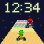 |
| Final Fantasy VI — Zozo / Rain & Rooftops | 117,480 | 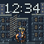 |
| Final Fantasy VI — Floating Continent / Edge of Ruin | 46,601 | 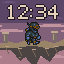 |
| Final Fantasy VI — Narshe Cavern / Dance for Treasure | 45,525 | 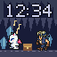 |
| Final Fantasy VI — Ultros / Fire Dance | 76,441 | 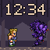 |
| Final Fantasy VI — Forest Swarm / Dance & Cure | 57,504 | 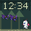 |

[Manifest and asset hashes](manifest.json) · [Format](FORMAT.md) · [Artwork provenance](ARTWORK.md).
