# Native clock pack 3 · 1.0.0

15 animated faces at 64×64, 25 FPS, 12-second loops. Native SNTL assets
use live clock digits; the GIF previews show fixed 12:34.

## Download and compatibility

[Download Pack 3](../snes-clock-pack-3-1.0.0.zip). Open `index.html` for an offline gallery.

This is a **native asset and firmware source package**, not a ready-to-flash
image. It requires the included SNTL player and a firmware rebuild. The older
SNPK download selector cannot load it. Install one pack at a time.

## Verified size

- Native assets: 819,556 bytes.
- Compiled OTA image with build-only credentials: **1,819,776 bytes**.
- OTA application partition: 1,835,008 bytes.
- Space remaining: **15,232 bytes (14.9 KiB)**.
- Static RAM: 71,520 bytes.

The complete selection compiled successfully using ESPHome 2026.8.2 for the
existing 4 MB ESP32 configuration. ZIP size is not on-device flash size.
Credentials, toolchain updates or firmware changes can change the final size;
recheck before installing. These native packs have not been tested on the
physical panel. [Compile evidence](compile-size.json) · [Pixel validation](validation.json).

## Build

Use Python 3 and ESPHome 2026.8.2. From this unpacked directory:

```sh
python3 tools/build_firmware.py
esphome compile build/sizecheck.yaml
```

The supplied `firmware/snes-clock.yaml` contains deliberately fake credentials
for compile checks. Set your own Wi-Fi, encrypted API and OTA credentials in a
private copy before any deployment, and confirm that the panel wiring matches
your hardware. Never commit those credentials. The script only generates build
files; neither command uploads firmware. Firmware sources and native assets
are included so the selection can be rebuilt without the private gallery.

## Faces

| Face | Native bytes | Preview |
|---|---:|---|
| The Legend of Zelda: A Link to the Past — Fairy Fountain / Wings over Water | 71,341 | 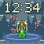 |
| The Legend of Zelda: A Link to the Past — Sanctuary / Zelda’s Escort | 37,740 | 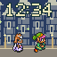 |
| The Legend of Zelda: A Link to the Past — Pyramid Chamber / Ganon’s Fire Ring | 46,950 | 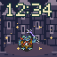 |
| Super Metroid — Crateria / Gunship Arrival | 35,644 | 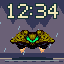 |
| Super Mario World 2: Yoshi’s Island — Kamek’s Flight / Midnight Magic | 56,324 |  |
| Super Mario All-Stars — Bowser’s Keep / Fire and Falling Bricks | 26,065 | 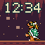 |
| Donkey Kong Country 2: Diddy’s Kong Quest — Gloomy Gulch / Dixie’s Lantern | 77,450 | 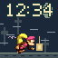 |
| Final Fantasy VI — Figaro / Desert Citadel | 4,415 | 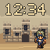 |
| Final Fantasy VI — Blackjack / Above the Clouds | 63,211 | 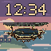 |
| Final Fantasy VI — Magitek / Esper Chamber | 25,167 | 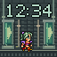 |
| Final Fantasy VI — Phantom Forest / Interceptor! | 99,632 | 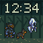 |
| Final Fantasy VI — South Figaro / Rooftop Escape | 111,782 | 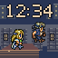 |
| Final Fantasy VI — Figaro Desert / Chocobo Dash | 82,890 | 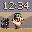 |
| Final Fantasy VI — Ultros / Fire on the River | 53,937 | 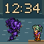 |
| Final Fantasy VI — Magitek Armor / Runic & Ice | 27,008 | 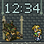 |

[Manifest and asset hashes](manifest.json) · [Format](FORMAT.md) · [Artwork provenance](ARTWORK.md).
